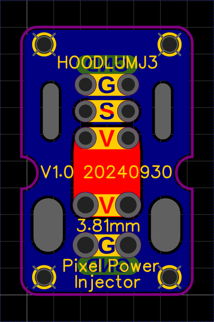
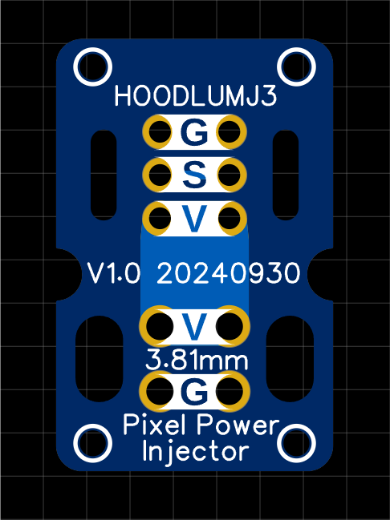

## Pixel Power Injectors PCB
### Medium Christmas Prop pixel power injector

16.256mm x 18.288mm x 1.6mm

These are primarily designed to be used with seed pixels on xmas props (but not limited)

{width=800}

### _Gerbers_
[Link to Gerbers .zip](./Gerber_Pixel-Prop-Interlink_PCB-Pixel-Power-Injector-Medium_2025-12-08.zip)

### _Features_
	+ Strain relief for input and output seed pixel wires
	+ Strain relief for input and output power 18awg.
	+ 5Amp @5V (tested to 10A for 10 mins, gets warm) 
	+ 5V and 12V
	+ can also use 3.81mm KF2EDG/15EDG 2P (curved or straignt pin) on input and output power

{height=200}
{height=200}
{height=200}
