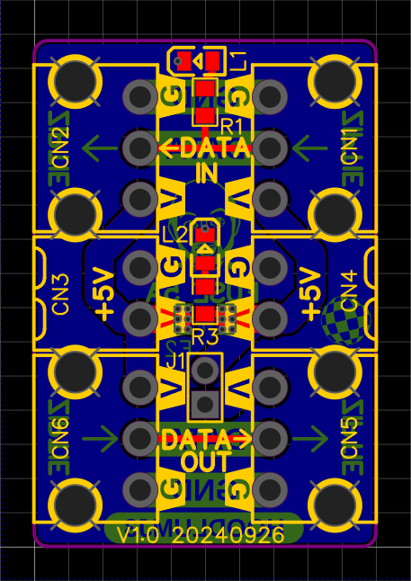
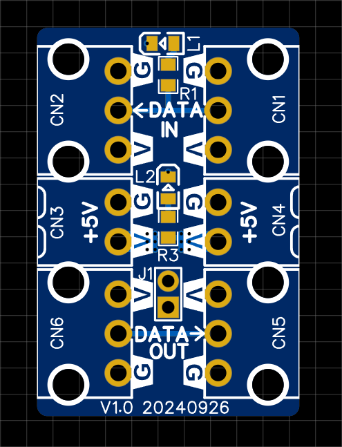
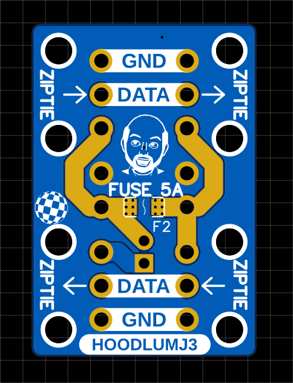
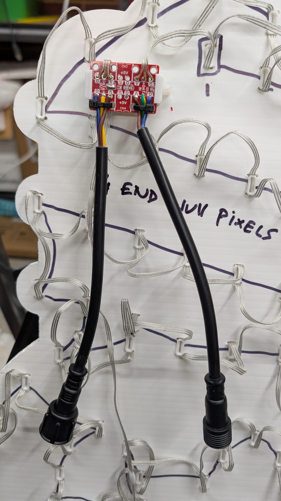
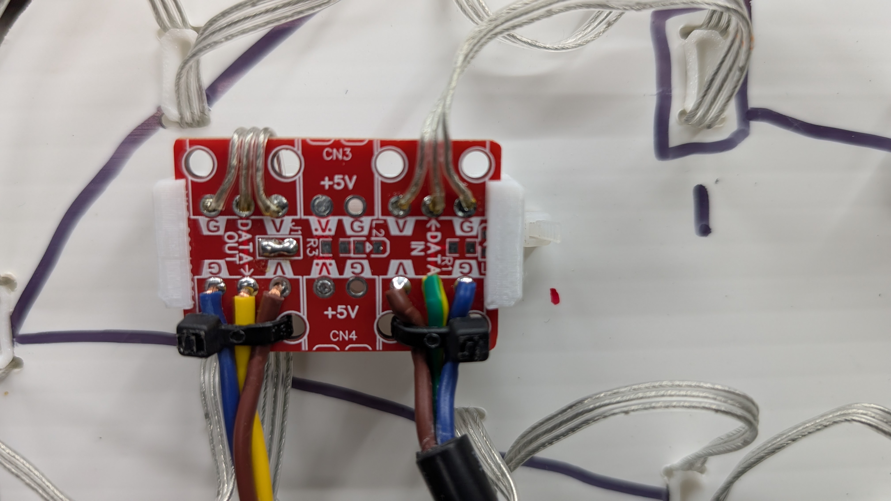
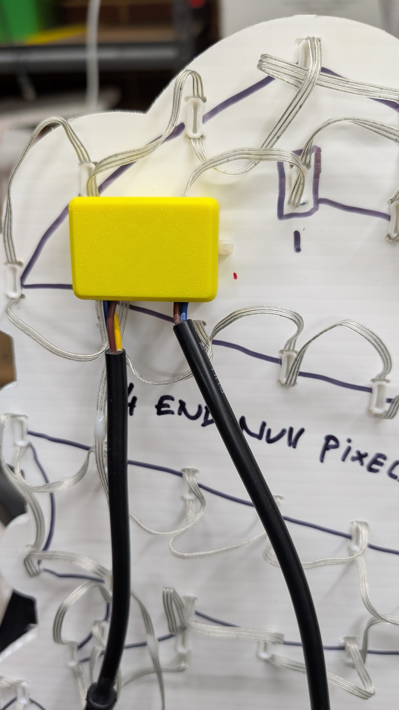
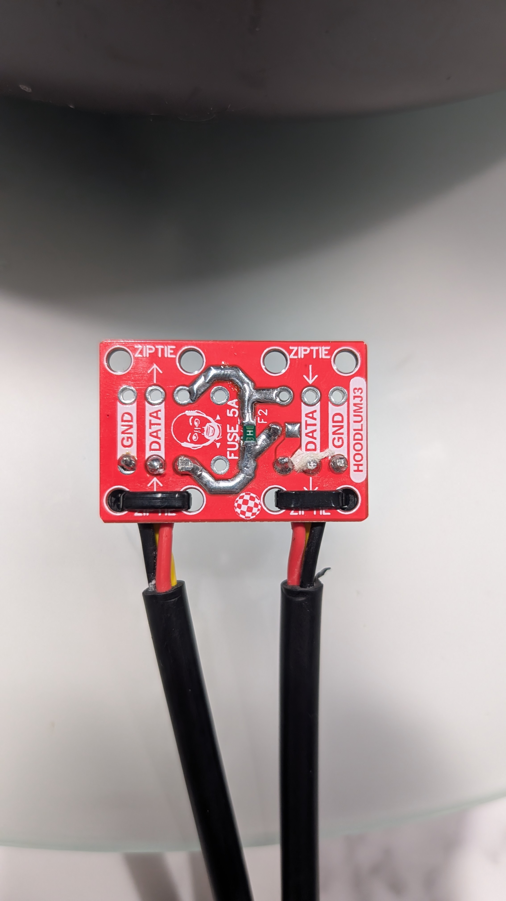

## Pixel Power Injectors PCB
### Christmas Prop Input Output

16.256mm x 18.288mm x 1.6mm

These are primarily designed to be used with seed pixels on xmas props (but not limited)

### _Gerbers_
[Link to Gerbers .zip](./Gerber_Pixel-Prop-Interlink_PCB-Pixel-Prop-InputOutput_2025-12-08.zip)

### _Features_

	+ Zip tie secure holes for input and output seed pixel / xconnect wire 0.75mm^2
	+ Spot for 5A 1204 fuse (underneath) - can bridge for no fuse
	+ exposed + voltage tracks to load solder onto
	+ optional jumper to break voltage traversing to next prop - can bridge (i do)
	+ 5Amp @5v (tested to 10A, when bridged, for 10 mins, cool to touch)
	+ 5V and 12V
	+ 805 led and 805 resistor for data indicator.
	+ 805 led and 805 resistor for power indicator.
	+ can also use 3.81mm KF2EDG/15EDG 3P/2P (curved or straignt pin) on input and output (for quick connects)		

