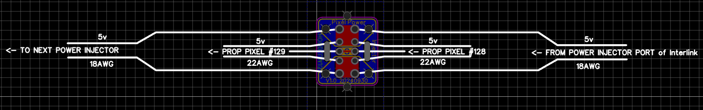
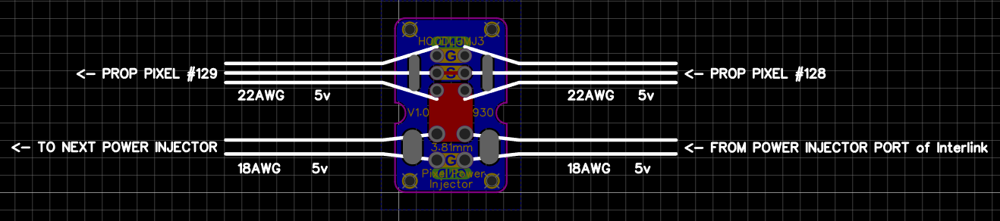
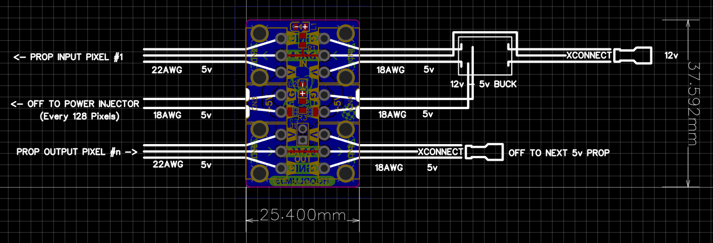

## PixelPowerInjectors_PCB
A set of Christmas Prop pixel power injectors

These are primarily designed to be used with seed pixels on xmas props (not limited)

Options are :

+ [Small version (16.256mm x 18.288mm x 1.6mm)](./Small/README.md)

	_Features_
	* Strain relief for input and output seed pixel wires
	* Strain relief for input and output power.
	* 5Amp @5V (tested to 10A for 10 mins, gets warm) 
   
+ [Medium version (16.256mm x 25.400mm x 1.6mm)](./Medium/README.md)

	_Features_
	* Strain relief for input and output seed pixel wires
	* Strain relief for input and output power.
	* 5Amp @5v (tested to 10A for 10 mins, gets warm) 
   
+ [Prop Input Output (25.400mm x 37.592 x 1.6mm)](./PropInputOutput/README.md)

	_Features_
	* Zip tie secure holes for input and output seed pixel / xconnect wires
	* Spot for 5A fuse (underneath) - can bridge for no fuse
	* exposed + voltage tracks to load solder onto
	* optional jumper to break voltage traversing to next prop - can bridge (i do)
	* 5Amp @5v (tested to 10A for 10 mins, cool to touch) 

