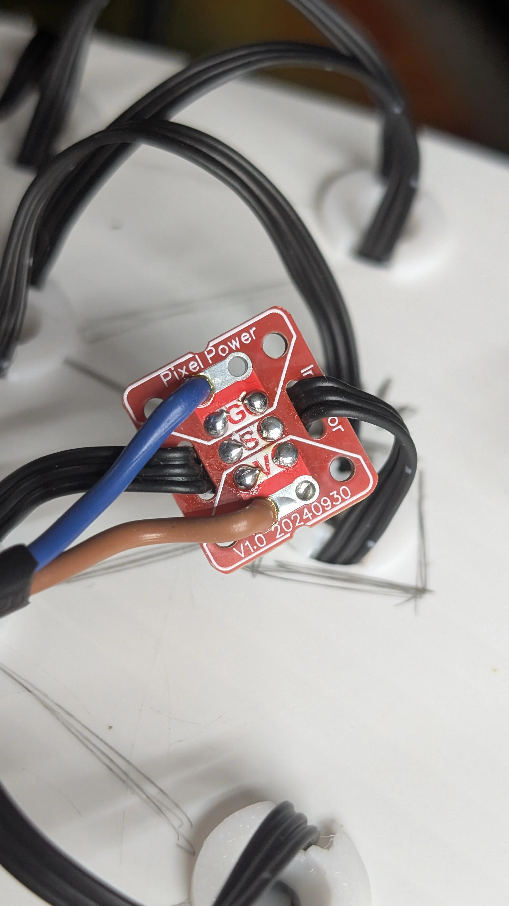
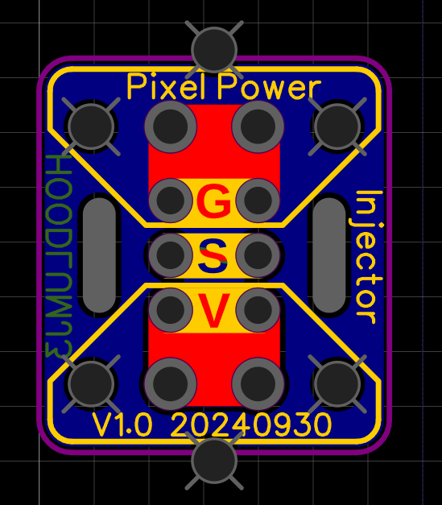
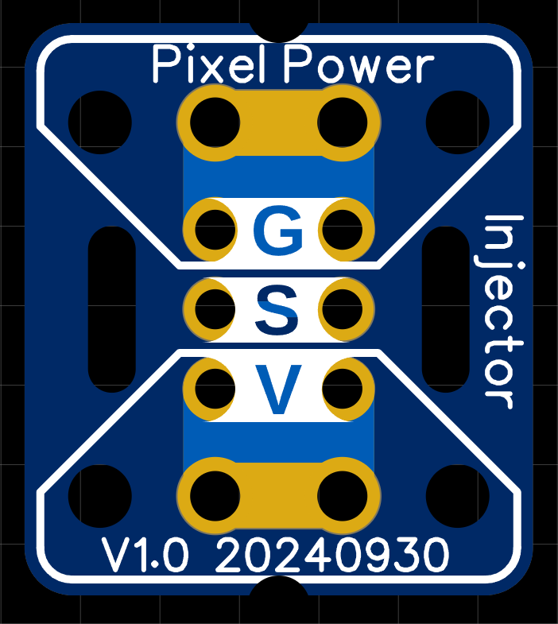

## Pixel Power Injectors PCB
### Small Christmas Prop pixel power injector

16.256mm x 18.288mm x 1.6mm

These are primarily designed to be used with seed pixels on xmas props (but not limited)

### _Gerbers_
[Link to Gerbers .zip](./Gerber_Pixel-Prop-Interlink_PCB-Pixel-Power-Injector-Small_2025-12-07.zip)

{width=800}

### _Features_
	+ Strain relief for input and output seed pixel wires
	+ Strain relief for input and output power 18awg / 1.0mm^2.
	+ 5Amp @5V (tested to 10A for 10 mins, gets warm) 
	+ 5V and 12V

{height=200}
{height=200}
{height=200}
{height=200}
